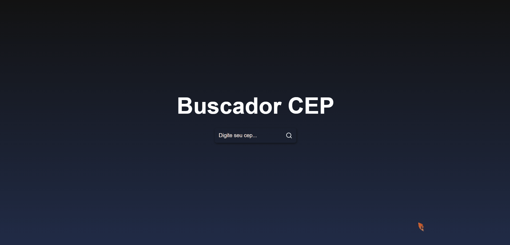

# Buscador de CEP

Seja bem-vindo(a) ao Buscador de cep, a sua central para explorar seu cep de forma rápida e fácil! 🌟

Neste repositório, são disponibilizados detalhes sobre a criação do notável buscador de CEP, proporcionando a conveniência de acessar informações de endereços diretamente na sua tela. O BuscaCEP é um projeto concebido como parte do vídeo do Sujeito Programador, destinado a avaliar habilidades adquiridas ao longo dos estudos e a testar competências que abrangem desde a usabilidade e criatividade até a tomada de decisões técnicas.

## Índice 🗂️

- Visão Geral
  - Screenshot
  - Link Deploy
- Sobre
  - Propósito
  - Funcionalidade
- Meu processo
  - Ferramentas
  - Decisões
- Como rodar o código 
  - Pré requisitos
  - Instalação
  - Execução
- Autor

## Visão Geral 👀

### Screenshot

#### Desktop



#### Mobile


### Link Deploy

Siga o link e veja nossa [BuscaCEP](https://buscador-de-cep-black.vercel.app/)

## Sobre 📖

## Propósito

O propósito principal do projeto BuscaCEP é oferecer uma solução eficaz e conveniente para a busca de informações de endereços por meio do CEP, visando aprimorar a experiência do usuário ao simplificar e agilizar o acesso a esses dados. Além disso, o projeto serve como uma plataforma para avaliar e demonstrar as habilidades técnicas, de usabilidade e criatividade adquiridas durante os estudos, proporcionando um ambiente prático para aplicação e teste dessas competências.

## Funcionalidade

A aplicação BuscaCEP possui uma Página Inicial que utiliza uma API para buscar informações com base no CEP inserido pelo usuário. Após inserir o CEP desejado, a aplicação exibe as informações de localização correspondentes ao CEP fornecido. Este processo simplifica a busca de detalhes de endereço, oferecendo uma maneira rápida e fácil de encontrar informações precisas sobre uma determinada localidade apenas com o uso do CEP.

## Meu processo 🔨

## Ferramentas

* React.js: A aplicação foi construída usando o React.js, uma biblioteca JavaScript de código aberto amplamente adotada para criar interfaces de usuário interativas e reativas de maneira eficiente.

* CSS: utilizei CSS para estilizar e formatar o layout da minha aplicação web, proporcionando uma experiência visualmente agradável e coesa para os usuários. Isso incluiu a definição de estilos para elementos como cores, tipografia, espaçamento, alinhamento e outros aspectos visuais, garantindo uma apresentação consistente e profissional em toda a aplicação. 

* Na implementação da funcionalidade de busca de dados do usuário, integrei uma API para este fim.
* Utilizei a biblioteca Axios, amplamente reconhecida no ecossistema React, para efetuar requisições HTTP e estabelecer a conexão com a API de maneira eficaz.
* A escolha do Axios permitiu uma comunicação eficiente entre a minha aplicação e a API, garantindo a obtenção dos dados necessários com base no CEP fornecido pelo usuário.
* Além disso, para enriquecer a experiência do usuário e melhorar a interface da aplicação, integrei os ícones disponíveis na biblioteca React Icons, contribuindo para uma apresentação visual mais apelativa e amigável.
 


## Como rodar o código 💻

### pré requisitos:
Antes de começar, verifique se você tem um gerenciador de pacotes instalado em sua máquina. Se não tiver, você pode instalar o NPM digitando o seguinte comando em seu terminal:

````
 npm install npm@latest -g

````
### Instalação:

1 - Baixe o arquivo ZIP do projeto e extraia-o em uma pasta de sua escolha.

2 - Navegue até a pasta raiz do projeto usando o terminal. Você pode fazer isso digitando o seguinte comando (substitua "diretório da pasta" pelo caminho real):

````
cd caminho/para/pasta/do/projeto
````

3 - No terminal, execute o seguinte comando para instalar as dependências necessárias:
````
npm install
````

### Execução:
4 - Depois de concluir a instalação das dependências, inicie a aplicação usando o comando:
````
npm run dev
````

Agora você poderá ver o resultado em um ambiente de desenvolvimento através do seu navegador.

#### Também é possível usar o Git Clone:

1 - Em uma pasta de sua escolha, abra o terminal e digite o seguinte comando:
````
git clone https://github.com/carlosvfb/buscador-de-cep.git
````
Isso clonará o repositório para o diretório atual.

## Autor

Linkedin - [Carlos Vítor Faria Barboza](https://www.linkedin.com/in/carlos-barboza-080842218)

instagram - [carlos_vfb.dev](https://www.instagram.com/carlos_vfb.dev)


<a href="https://wakatime.com/badge/github/carlosvfb/buscador-de-cep"></a>
